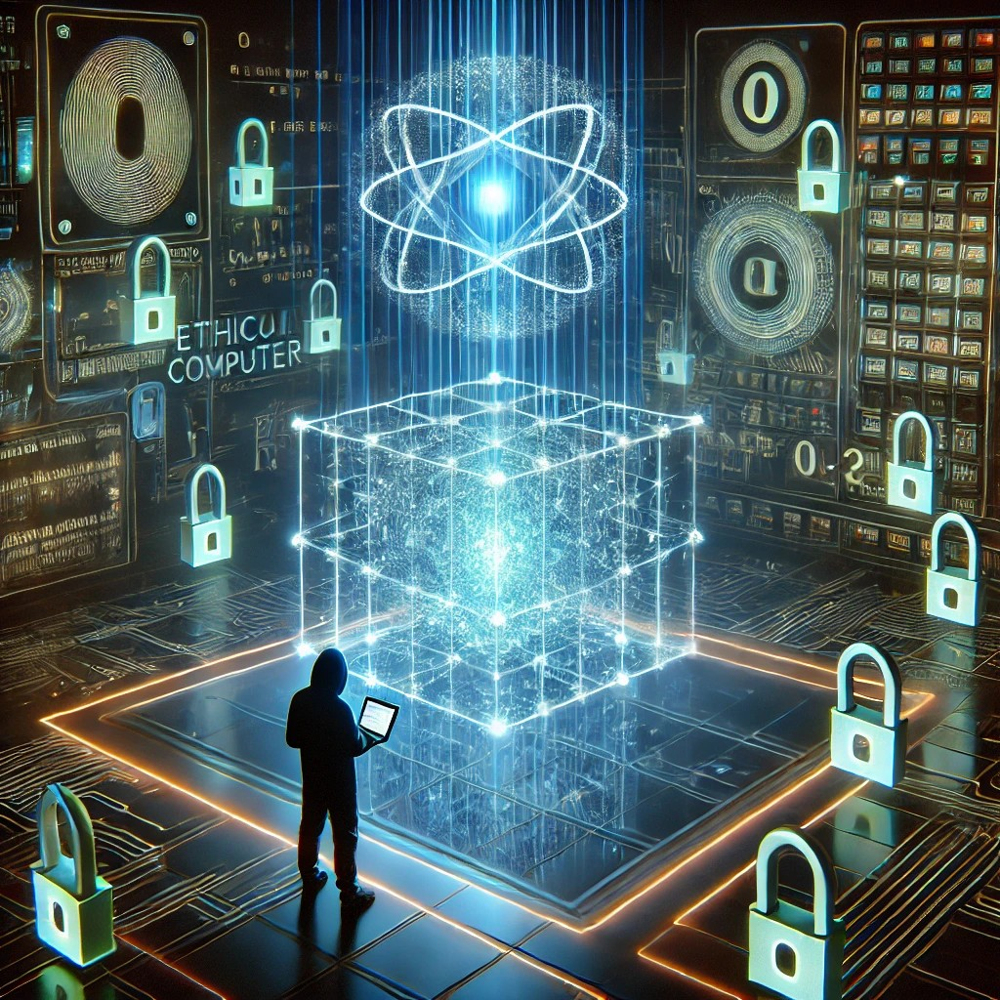

# **Casos Prácticos de Ethical Hacking con Computación Cuántica**

  

Estos casos prácticos permiten explorar diferentes escenarios de ciberseguridad y cómo la computación cuántica podría representar una amenaza a los métodos criptográficos actuales. Las herramientas mencionadas ofrecen una base sólida para realizar experimentos y comprender mejor el impacto de la computación cuántica en la seguridad.
---

### **1. Romper el cifrado RSA con Shor's Algorithm**

- **Objetivo**: Romper el cifrado RSA usando Shor’s Algorithm.
- **Herramientas**: IBM Qiskit, Microsoft Q#.
- **Paso a paso**:
  1. Configura el entorno cuántico.
  2. Genera un número grande (ej., 15).
  3. Aplica Shor’s Algorithm para factorizarlo.
  4. Observa la rapidez de la factorización cuántica.

---

### **2. Ataque de fuerza bruta cuántica con Grover's Algorithm**

- **Objetivo**: Realizar un ataque de fuerza bruta a una contraseña.
- **Herramientas**: IBM Qiskit, Cirq.
- **Paso a paso**: 
  1. Crea un conjunto de contraseñas.
  2. Implementa Grover’s Algorithm.
  3. Observa cómo reduce el tiempo de búsqueda cuántico.

---

### **3. Interceptación en redes cuánticas (QKD)**

- **Objetivo**: Interceptar claves distribuidas en una red cuántica.
- **Herramientas**: Qiskit, QuTiP.
- **Paso a paso**:
  1. Simula QKD para la distribución de claves.
  2. Intenta interceptar las claves cuánticas.
  3. Muestra cómo la seguridad de QKD puede ser comprometida.

---

### **4. Ataque cuántico a criptografía ECC**

- **Objetivo**: Romper criptografía ECC con Shor’s Algorithm.
- **Herramientas**: IBM Qiskit, Q#.
- **Paso a paso**: 
  1. Implementa ECC para cifrar datos.
  2. Aplica Shor’s Algorithm para factorizar la curva.
  3. Demuestra cómo las computadoras cuánticas rompen ECC.

---

### **5. Ataque cuántico a firmas digitales**

- **Objetivo**: Modificar una firma digital con un ataque cuántico.
- **Herramientas**: IBM Qiskit, Cirq.
- **Paso a paso**: 
  1. Crea una firma digital con criptografía asimétrica.
  2. Usa un ataque cuántico para alterar la firma.
  3. Verifica la vulnerabilidad de la función hash.

---

### **6. Ataque de Interferencia cuántica en comunicaciones**

- **Objetivo**: Realizar un ataque cuántico de interferencia en comunicaciones.
- **Herramientas**: IBM Qiskit, Microsoft Q#.
- **Paso a paso**: 
  1. Simula una transmisión cuántica.
  2. Introduce interferencia cuántica en los qubits.
  3. Demuestra cómo la interferencia puede alterar la transmisión.

---

### **7. Cracking de claves de AES con Quantum Computing**

- **Objetivo**: Romper la seguridad del cifrado AES con técnicas cuánticas.
- **Herramientas**: IBM Qiskit, Google Cirq.
- **Paso a paso**:
  1. Configura un sistema AES para cifrar datos.
  2. Aplica un algoritmo cuántico para realizar una búsqueda eficiente.
  3. Compara el tiempo de ataque clásico vs cuántico.

---

### **8. Ataque cuántico a redes de comunicaciones seguras**

- **Objetivo**: Romper comunicaciones seguras basadas en protocolos clásicos.
- **Herramientas**: IBM Qiskit, Q#.
- **Paso a paso**: 
  1. Simula una red de comunicaciones seguras.
  2. Intenta usar un ataque cuántico para obtener acceso a los datos cifrados.
  3. Evalúa la efectividad del ataque cuántico comparado con métodos tradicionales.

---

### **9. Ataque cuántico a sistemas de blockchain**

- **Objetivo**: Realizar un ataque a la seguridad de un sistema de blockchain utilizando computación cuántica.
- **Herramientas**: IBM Qiskit, Cirq.
- **Paso a paso**: 
  1. Implementa un sistema básico de blockchain.
  2. Aplica algoritmos cuánticos para romper el cifrado de las transacciones.
  3. Evalúa la posibilidad de ataques cuánticos a la integridad del sistema.

---

### **10. Ataque cuántico a protocolos de autenticación multifactor**

- **Objetivo**: Romper la autenticación multifactor utilizando un ataque cuántico.
- **Herramientas**: IBM Qiskit, Microsoft Q#.
- **Paso a paso**:
  1. Configura un sistema de autenticación multifactor.
  2. Intenta descifrar los factores utilizando técnicas cuánticas.
  3. Muestra cómo los ataques cuánticos pueden comprometer los protocolos tradicionales.

--- 
Saludos!
